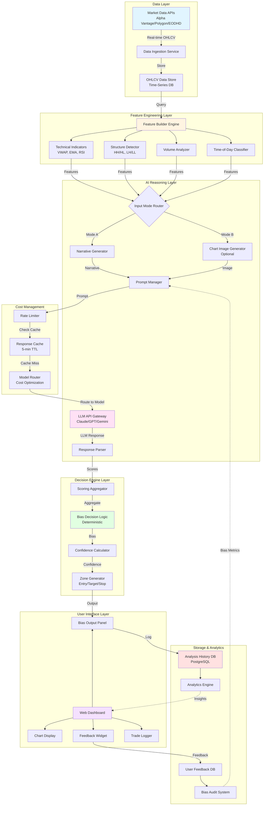
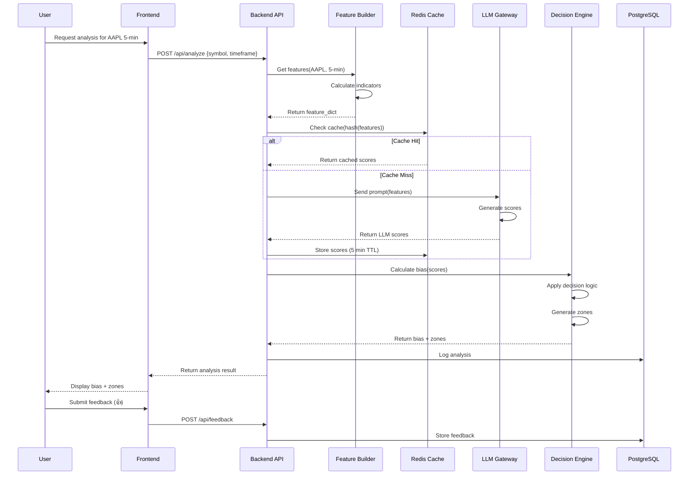
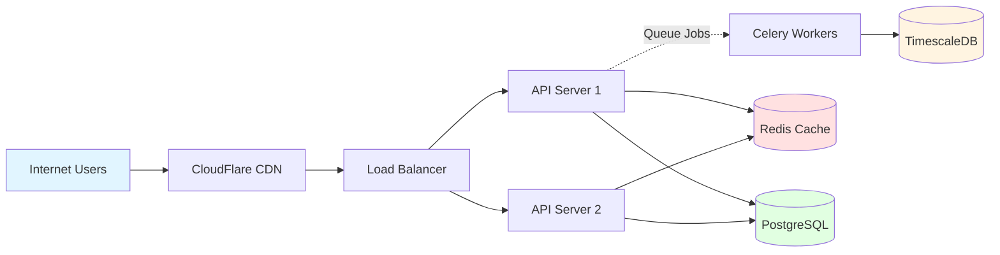

# ChartSense Technical Architecture

## System Architecture Diagram



---

## Component Deep Dive

### 1. Data Layer

**Purpose:** Acquire and store market data

#### Components:

**Market Data APIs**
- Primary: EODHD.com or Alpha Vantage
- Latency target: <10 seconds
- Data format: OHLCV per 5-min intervals

**Data Ingestion Service**
- Technology: Python with `requests` or `aiohttp`
- Schedule: Real-time WebSocket (Polygon) or REST polling every 5 min
- Error handling: Retry logic, fallback providers

**OHLCV Data Store**
- Technology: **InfluxDB** (time-series) or **TimescaleDB** (PostgreSQL extension)
- Retention: 90 days live, 2 years archived
- Indexing: By symbol, timeframe, timestamp

---

### 2. Feature Engineering Layer

**Purpose:** Transform raw data into trading insights

#### Feature Builder Engine
```python
class FeatureBuilder:
    def build(self, ohlcv_data):
        return {
            'trend': self.detect_trend(),
            'structure': self.detect_structure(),
            'volume': self.analyze_volume(),
            'vwap_relation': self.calc_vwap_relation(),
            'time_context': self.classify_time()
        }
```

**Key Algorithms:**
- **Trend Detection:** EMA crossovers, slope analysis
- **Structure Detection:** Swing high/low tracking, fractal patterns
- **Volume Analysis:** Volume ratio vs. 20-period average
- **VWAP Calculation:** Cumulative (Price × Volume) / Cumulative Volume

---

### 3. AI Reasoning Layer

**Purpose:** LLM-based contextual analysis

#### Prompt Template Example

```
You are an expert day trader analyzing a 5-minute chart.

MARKET CONTEXT:
- Symbol: {REDACTED}  # Prevents symbol bias
- Timeframe: 5-minute
- Session: {session_type}

TECHNICAL FEATURES:
{feature_narrative}

TASK:
Score the following factors from -2 to +2:
1. Trend (directional strength)
2. Structure (clean vs choppy)
3. Volume (confirming vs divergent)
4. Control (VWAP acceptance)
5. Momentum (expanding vs exhausting)
6. Time_Risk (session quality)

CRITICAL:
- Do NOT predict prices
- Do NOT recommend trades
- ONLY provide numerical scores
- Include brief reasoning (1 sentence per factor)

FORMAT:
{
  "Trend_Score": <int>,
  "Structure_Score": <int>,
  ...
  "Reasoning": {
    "Trend": "<explanation>",
    ...
  }
}
```

#### LLM API Gateway
- **Primary:** Anthropic Claude 4.5 Sonnet
- **Fallback:** Google Gemini 2.0 Flash
- **Vision (Optional):** OpenAI GPT-4o
- **Timeout:** 20 seconds max
- **Retries:** 2 attempts with exponential backoff

---

### 4. Decision Engine Layer

**Purpose:** Deterministic bias calculation

#### Bias Decision Logic

```python
def calculate_bias(scores: dict) -> dict:
    total = sum(scores.values())
    
    if total >= 3:
        bias = "BUY"
    elif total <= -3:
        bias = "SELL"
    else:
        bias = "NO TRADE"
    
    # Confidence based on score alignment
    aligned_factors = sum(1 for s in scores.values() if abs(s) >= 1)
    
    if aligned_factors >= 4:
        confidence = "HIGH"
    elif aligned_factors >= 2:
        confidence = "MEDIUM"
    else:
        confidence = "LOW"
    
    return {
        "bias": bias,
        "confidence": confidence,
        "total_score": total,
        "aligned_factors": aligned_factors
    }
```

#### Zone Generator
- **Entry Zone:** Price ± 0.3% ATR buffer around key level
- **Target Zone:** Next resistance/support ± 0.5% ATR
- **Invalidation:** Recent swing low (BUY) or high (SELL)

---

### 5. User Interface Layer

**Technology Stack:**
- **Frontend:** React + TailwindCSS
- **Charting:** TradingView Lightweight Charts
- **State Management:** React Context or Zustand
- **API Client:** Axios with interceptors

**Key Features:**
1. **Live Chart Display** with VWAP overlay
2. **Bias Panel** showing color-coded output (green/red/gray)
3. **Score Breakdown** visual (bar chart)
4. **Feedback Widget** (thumbs up/down)
5. **Trade Journal** table

---

### 6. Storage & Analytics

#### Databases

**Analysis History (PostgreSQL)**
```sql
CREATE TABLE analyses (
    id UUID PRIMARY KEY,
    timestamp TIMESTAMP,
    symbol VARCHAR(10),
    timeframe VARCHAR(5),
    features JSONB,
    llm_scores JSONB,
    bias VARCHAR(10),
    confidence VARCHAR(10),
    entry_zone NUMRANGE,
    target_zone NUMRANGE,
    invalidation_price DECIMAL
);
```

**User Feedback (PostgreSQL)**
```sql
CREATE TABLE feedback (
    id UUID PRIMARY KEY,
    analysis_id UUID REFERENCES analyses(id),
    user_id UUID,
    helpful BOOLEAN,
    took_trade BOOLEAN,
    outcome VARCHAR(20), -- WIN/LOSS/BREAKEVEN/DIDNT_ENTER
    comments TEXT,
    timestamp TIMESTAMP
);
```

#### Analytics Engine

**Weekly Reports:**
- Bias distribution (BUY/SELL/NO TRADE %)
- Win rate by bias type
- Average score by factor
- Sector preference detection (bias audit)

---

### 7. Cost Management Layer

#### Rate Limiter
- **Free Tier:** 10 analyses/day per user
- **Paid Tier:** 100 analyses/day per user
- Implementation: Redis with sliding window

#### Response Cache
- **Key:** `hash(features + model_version)`
- **TTL:** 5 minutes
- **Hit Ratio Target:** 40%+
- Technology: Redis

#### Model Router
```python
def select_model(user_tier, cache_miss):
    if user_tier == "FREE":
        return "gemini-2.0-flash"  # Cheapest
    elif user_tier == "BASIC":
        return "gpt-4o-mini"
    else:  # PREMIUM
        return "claude-4.5-sonnet"
```

---

## Data Flow Sequence

### Typical Analysis Request



---

## Technology Stack Summary

### Backend
- **Language:** Python 3.11+
- **Framework:** FastAPI
- **Task Queue:** Celery + Redis (for async data fetching)
- **ORM:** SQLAlchemy

### Frontend
- **Framework:** React 18
- **UI Library:** TailwindCSS + shadcn/ui
- **Charts:** TradingView Lightweight Charts
- **Build Tool:** Vite

### Infrastructure
- **Hosting:** AWS or Google Cloud
- **Compute:** Docker containers on ECS/Cloud Run
- **Databases:** 
  - TimescaleDB (time-series)
  - PostgreSQL (relational)
  - Redis (cache + rate limiting)
- **Monitoring:** Datadog or Grafana + Prometheus

### APIs
- **Market Data:** Alpha Vantage (dev) → EODHD (prod)
- **LLM:** Anthropic Claude API (primary)
- **Authentication:** Auth0 or Firebase Auth

---

## Security Considerations

1. **API Key Management:** Store in environment variables, never in code
2. **User Data:** Encrypt PII at rest, HTTPS in transit
3. **Rate Limiting:** Per-user token bucket algorithm
4. **Input Validation:** Sanitize all symbol inputs to prevent injection
5. **LLM Output Validation:** Parse and validate JSON schema before processing

---

## Scalability Plan

### Current Design (MVP)
- **Capacity:** 1,000 concurrent users
- **Latency:** <3 seconds per analysis
- **Cost:** ~$2,000/month (LLM + infrastructure)

### Scale to 10,000 users
- **LLM Caching:** Increase hit ratio to 60% (saves $1,200/month)
- **Read Replicas:** For PostgreSQL
- **CDN:** For static frontend assets
- **Background Jobs:** Move heavy feature computation to queues
- **Auto-scaling:** Horizontal scaling for API servers

---

## Deployment Architecture



---

## Error Handling & Resilience

### LLM API Failures
1. **Retry Logic:** 2 retries with exponential backoff (1s, 3s)
2. **Fallback Model:** Switch to Gemini Flash if Claude fails
3. **Circuit Breaker:** Pause after 5 consecutive failures
4. **User Notification:** "Analysis temporarily unavailable, try again in 1 min"

### Data Provider Failures
1. **Multi-Provider Setup:** Alpha Vantage primary, Polygon backup
2. **Stale Data Handling:** Show warning if data >10 min old
3. **Graceful Degradation:** Use cached features if fresh data unavailable

---

## Monitoring & Alerts

### Key Metrics
- **API Latency:** P50, P95, P99
- **LLM Response Time:** Average per model
- **Cache Hit Ratio:** Target >50%
- **Error Rate:** <1% of requests
- **Cost per Analysis:** Daily tracking

### Alerts
- LLM API error rate >5% (15 min window) → PagerDuty
- PostgreSQL connection pool >80% → Email
- Daily LLM cost >$200 → Slack notification

---

## Appendix: Example API Endpoints

```
POST   /api/v1/analyze
GET    /api/v1/history
POST   /api/v1/feedback
GET    /api/v1/analytics/weekly
GET    /api/v1/user/usage
```

**Example Request:**
```json
POST /api/v1/analyze
{
  "symbol": "SPY",
  "timeframe": "5min"
}
```

**Example Response:**
```json
{
  "analysis_id": "uuid-here",
  "timestamp": "2025-12-19T13:45:00Z",
  "bias": "BUY",
  "confidence": "MEDIUM",
  "scores": {
    "trend": 2,
    "structure": 1,
    "volume": 0,
    "control": 1,
    "momentum": -1,
    "time_risk": 0
  },
  "zones": {
    "entry": [580.50, 581.00],
    "target": [583.00, 584.00],
    "invalidation": 579.20
  },
  "risk_notes": [
    "Volume not confirming — wait for expansion",
    "Mid-session, reduced edge"
  ]
}
```
